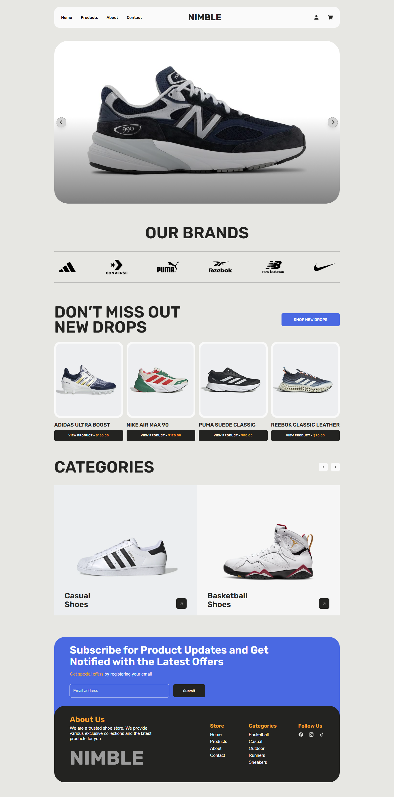

# Nimble Store

## Deskripsi

**Nimble Store** adalah website toko sepatu dengan desain modern dan kekinian. Website ini dirancang untuk memberikan pengalaman belanja online yang responsif, interaktif, dan user-friendly. Selain menampilkan katalog produk, website ini juga dilengkapi dengan fitur CRUD untuk pengguna, produk, dan komentar, sehingga mempermudah pengelolaan toko oleh admin.

## Preview



## Teknologi yang Digunakan

-   **CodeIgniter 3 (CI3):** Framework PHP yang digunakan untuk membangun backend.
-   **TailwindCSS:** Membantu membuat desain website yang responsif dan modern.
-   **JavaScript:** Logika interaktif pada frontend.
-   **Preline UI:** Komponen UI untuk meningkatkan estetika website.
-   **SwiperJS:** Membuat slider interaktif untuk katalog produk.
-   **SweetAlert2:** Memberikan notifikasi dan konfirmasi interaktif pada website.

## Struktur Direktori

```

nimble-store/
├── application/
├── database/
├── node_modules/
├── preview/
├── public/
├── system/
├── vendor/
├── .editorconfig
├── .eslintrc
├── .gitignore
├── .htaccess
├── composer.json
├── composer.lock
├── example.php
├── index.php
├── license.txt
├── package.json
├── package-lock.json
├── postcss.config.js
├── README.md
├── tailwind.config.js

```

## Cara Mengunduh dan Menjalankan

Ikuti langkah-langkah berikut untuk mengunduh dan menjalankan Nimble Store di server lokal Anda:

1. **Clone Repository**
   Jalankan perintah berikut untuk mengunduh project ke komputer Anda.

    ```bash
    git clone https://github.com/salmanabdurrahman/nimble-store.git
    cd nimble-store
    ```

2. **Instalasi Dependencies**
   Instal dependensi yang diperlukan dengan menjalankan perintah:

    ```bash
    npm install
    composer install
    ```

3. **Build CSS**
   Bangun file CSS menggunakan TailwindCSS dengan perintah berikut:

    ```bash
    npm run build-css
    ```

4. **Setup Database**

    - Buat database baru dengan nama `nimble_store`.
    - Import file SQL dari folder `database` untuk setup awal database Anda.

5. **Konfigurasi CodeIgniter**

    - Atur file konfigurasi di `application/config/config.php` sesuai dengan URL project Anda.
    - Atur file database di `application/config/database.php` sesuai dengan pengaturan server lokal Anda.

6. **Jalankan Server**

    - Jika Anda menggunakan XAMPP, pindahkan folder project ini ke dalam folder `htdocs`.
    - Jika Anda menggunakan Laragon, pindahkan ke dalam folder `www`.
    - Akses project melalui browser dengan URL `http://localhost/nimble-store`.

7. **Testing Website**
    - Login sebagai admin untuk mengelola produk.
    - Uji fitur-fitur CRUD dan interaksi lainnya.

Selamat mencoba Nimble Store! 🎉
